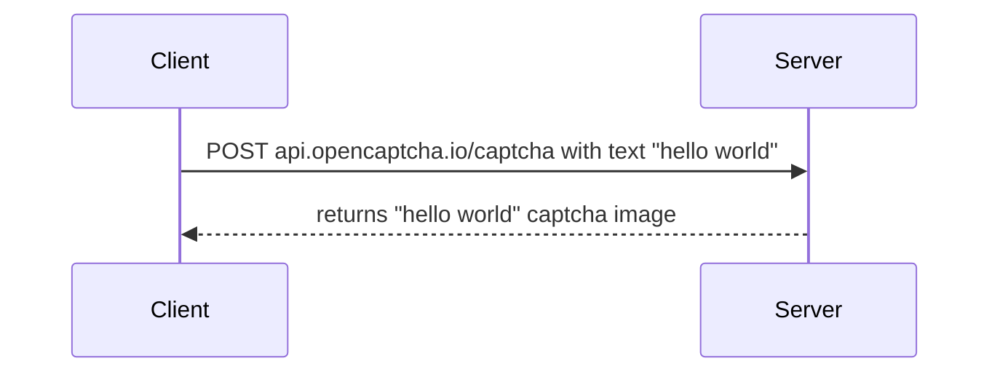

# OpenCaptcha

OpenCaptcha is a free, public API that generates captcha images.

Below are examples of captcha images generated by OpenCaptcha.

[//]: # (TODO: Add examples of multi-ligual images here)

OpenCaptcha is available for free at api.opencaptcha.io, alternatively you can host it yourself.

## Table of Contents

- [Features](#features)
- [Install](#install)
- [Usage](#usage)
- [Contributing](#contributing)
- [License](#license)

## Install

The API is available for free at api.opencaptcha.io.

However, if you want to get it working on your local environment, keep reading.

### Getting started

Development requirements are the following:
- Visual Studio 2022
    - with `ASP.NET and web development` installed from Visual Studio Installer
- .NET 8 SDK
- Windows Operating System

To run the API:
1. Open the solution in Visual Studio 2022.
2. Build and launch the Captcha.WebApi project.
3. API can be accessed at:
    - localhost:5280

### Running tests

To run unit functional tests, you need to run WebApi project and then run the functional tests.

1. Build the solution
2. Open Terminal
3. Navigate to the path `/src/Captcha.WebApi`
4. Run command: `dotnet run`
5. Open Visual Studio (or any other test runner) and run the functional tests.

## Features

- **Free and Unrestricted**: No cost, no API limits, no API key needed.
- **Multi-Language Support**: Generates captchas in several languages, such as Mandarin, Arabic, Spanish, and more.
- **Customizable**: Adjust captcha difficulty and size as needed.

OpenCaptcha API is currently deployed without any restrictions at https://api.opencaptcha.io.

## Usage

## Acknowledgements

The code that generates captcha has originally been published on February 2, 2004.
- https://www.codeproject.com/Articles/5947/CAPTCHA-Image
- http://www.brainjar.com/dotnet/captchaimage/

## Contributing

Pull requests are welcome. Please make sure to update tests as appropriate.

## License

[MIT](https://choosealicense.com/licenses/mit/)
