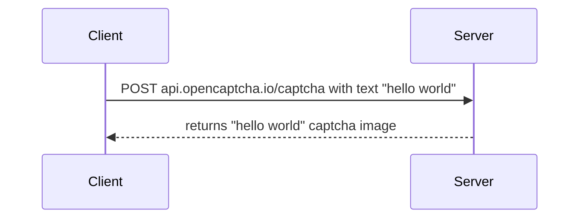

# OpenCaptcha


[//]: # (![badge]&#40;&#41;)
[//]: # (![badge]&#40;&#41;)
[//]: # (TODO: Add a badge here for Azure Container Instances deployment)
[](LICENSE)
[](https://codecov.io/gh/ashtonav/opencaptcha)
[](https://github.com/ashtonav/opencaptcha/actions/workflows/dotnet.yml)

OpenCaptcha is a free, publicly available API that generates captcha images from text.

Please see an example of captcha generated below:


## Table of Contents

- [Features](#features)
- [Security](#security)
- [Background](#background)
- [Install](#install)
- [Usage](#usage)
- [API](#api)
- [Contributing](#contributing)
- [License](#license)

## Features

- **Free and Unrestricted**: No cost, no API limits, no API key needed.
- **Multi-Language Support**: Generates captchas in several languages, such as Mandarin, Arabic, Spanish, and more.
- **Customizable**: Adjust captcha difficulty and size as needed.

## Background

This is a hobby project

### Any optional sections

## Install

This module depends upon a knowledge of [Markdown]().

```
```

### Any optional sections

## Usage




```
```

Note: The `license` badge image link at the top of this file should be updated with the correct `:user` and `:repo`.

### Any optional sections

## API

### Any optional sections

## More optional sections

## Contributing

Pull requests are welcome. For major changes, please open an issue first
to discuss what you would like to change.

Please make sure to update tests as appropriate.

[//]: # (### Any optional sections)

## License

[MIT](https://choosealicense.com/licenses/mit/)


### Honourable mentions

The code that generates captcha has originally been published on February 2, 2004.
- https://www.codeproject.com/Articles/5947/CAPTCHA-Image
- http://www.brainjar.com/dotnet/captchaimage/

## Running tests

To run unit functional tests, you need to run WebApi project and then run the functional tests.

1. Build the solution
2. Open Terminal
3. Navigate to the path `/src/Captcha.WebApi`
4. Run command: `dotnet run`
5. Open Visual Studio (or any other test runner) and run the functional tests.

## Getting started
Development requirements are the following:
- Visual Studio 2022
    - with `ASP.NET and web development` installed from Visual Studio Installer
- .NET 8 SDK
- Windows Operating System

To run the API:
1. Open the solution in Visual Studio 2022.
2. Build and launch the Captcha.WebApi project.
3. API can be accessed at:
    - localhost:5280
